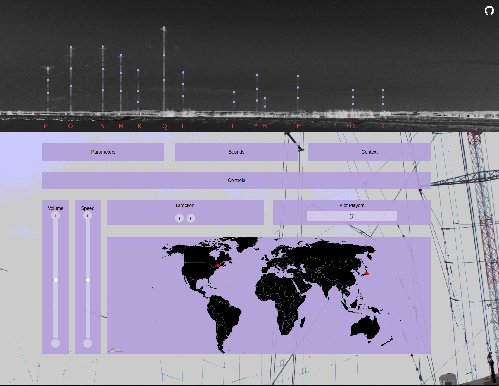

# DX Drone Machine



Towering 400 feet above the salt water marsh stood an intricate web of thick wire radio antennas transmitting shortwave all over the world. The horizontal wire antennas were suspended in the air with the support of 13 towers and were connected to the transmitter building via many kilometres of transmission lines.

Erected in 1938, the Radio Canada International (RCI) shortwave relay site was transmitting by 1942.  RCI broadcast to Europe, Africa, South America, and the Arctic.  In addition to Canadian broadcasts, this site also served as a relay for Radio China, Radio Japan, Radio Korea, Voice of Vietnam, and Vatican Radio. Located in Sackville, New Brunswick, it was perfectly positioned to transmit across the Atlantic Ocean, and covered most of the globe with its transmissions. It was the only high power shortwave relay station in Canada.

In 2012, RCI shortwave service was terminated.  The last Canadian international shortwave broadcast was sent in June of 2012, the final international relays were sent in October 2012, the last arctic broadcast (and the final broadcast to ever transmit from this site) was sent in November 2012.  

To start the server:
```
python3 app.py 'http://<ip>:<port>'
```

## Audio

To keep them web friendly and under 1Gig. convert them to flac before publishing:

    cd audio
    for audio in $(ls); do ffmpeg -i $audio "${audio%.*}.flac"; done

## Authors

- Artist: Amanda Dawn Christie
- Developer: [Vsevolod Ivanov](https://github.com/binarytrails)
